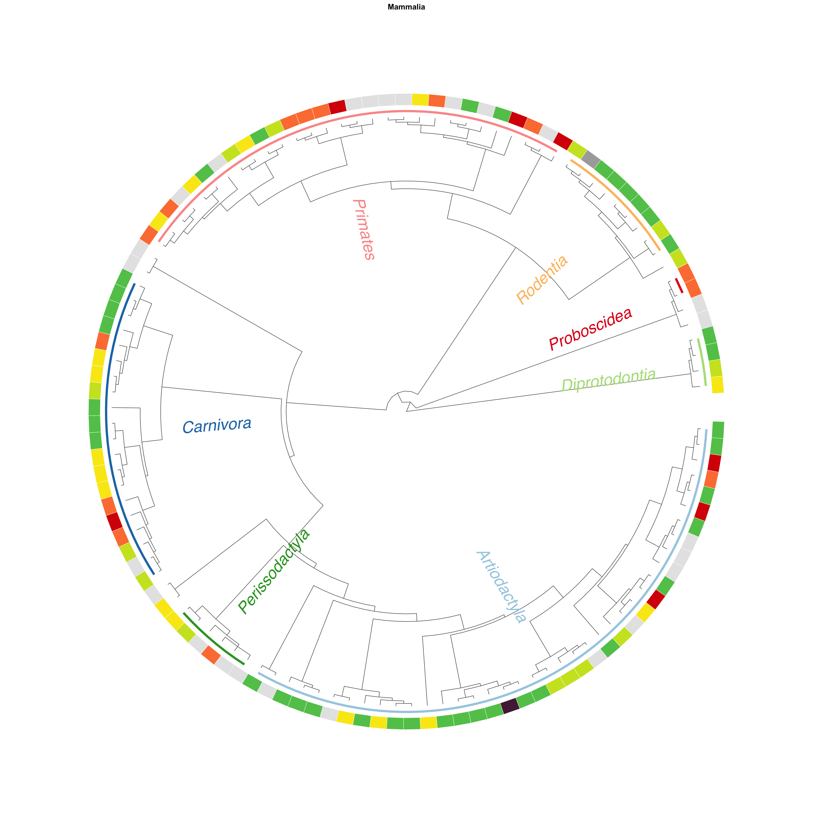
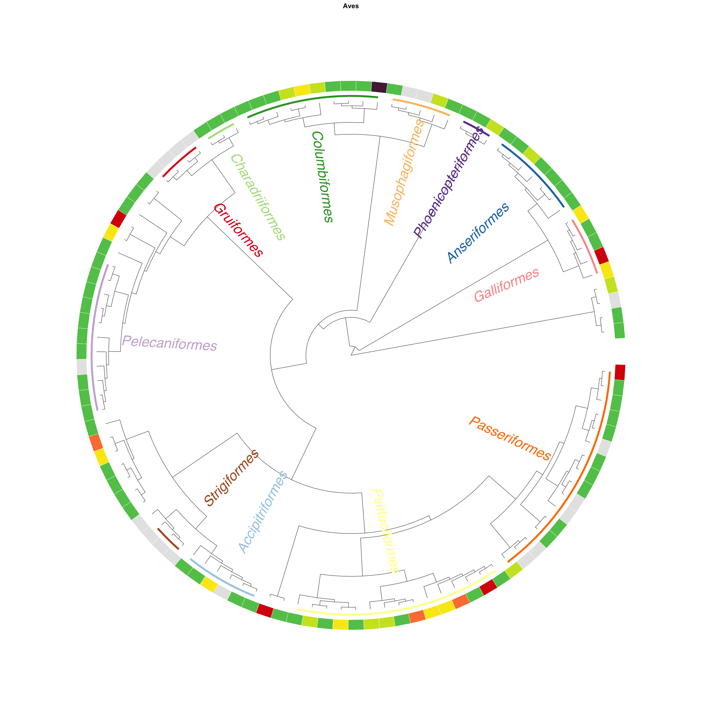
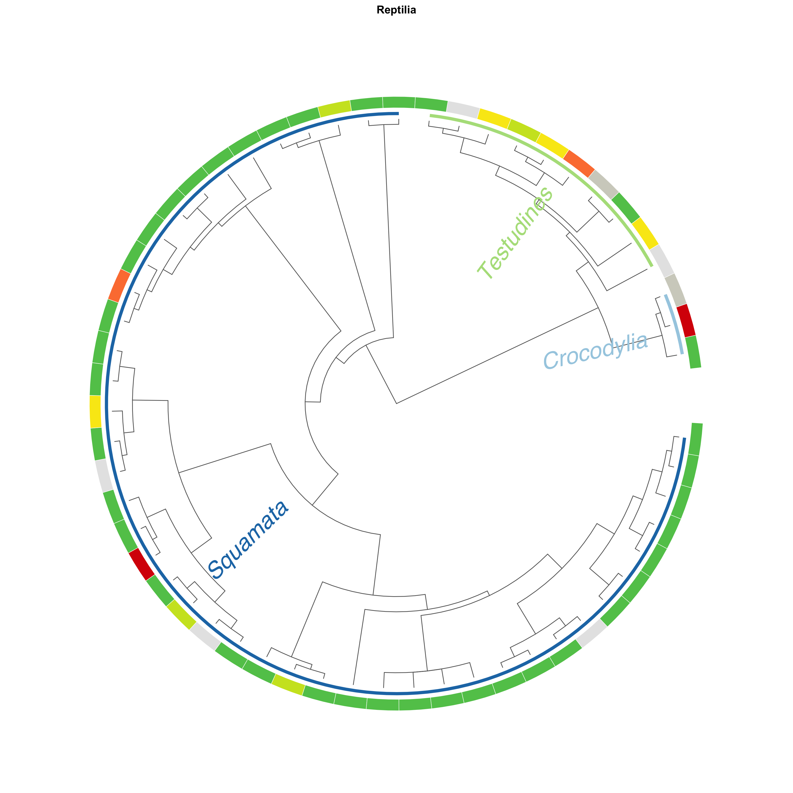
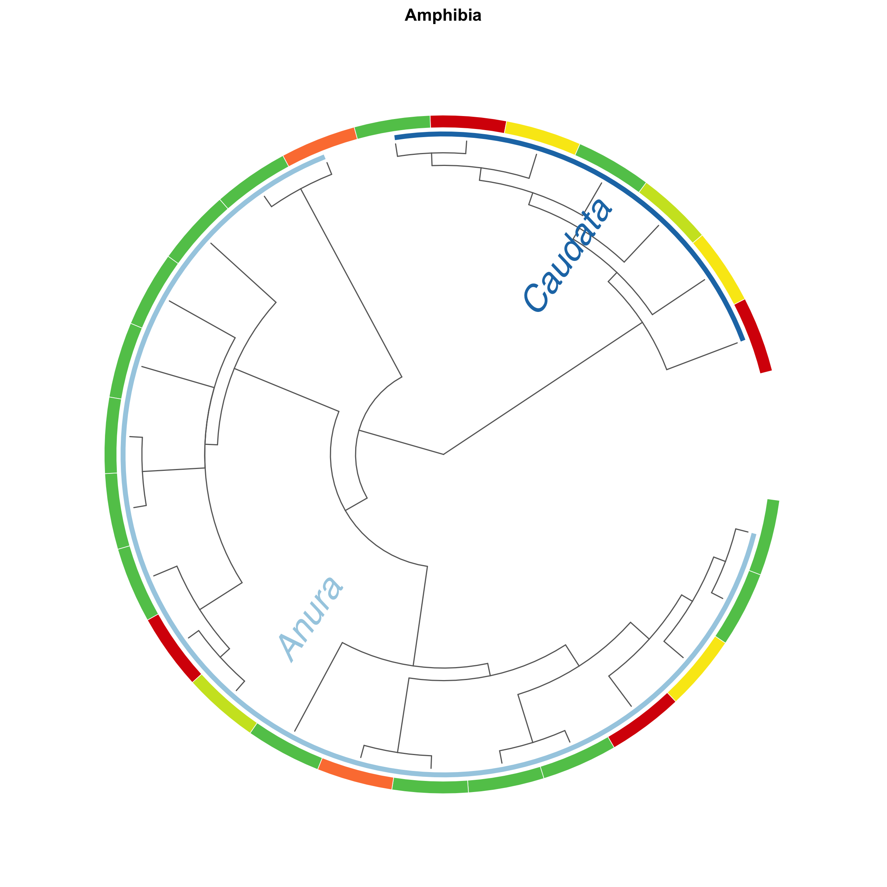
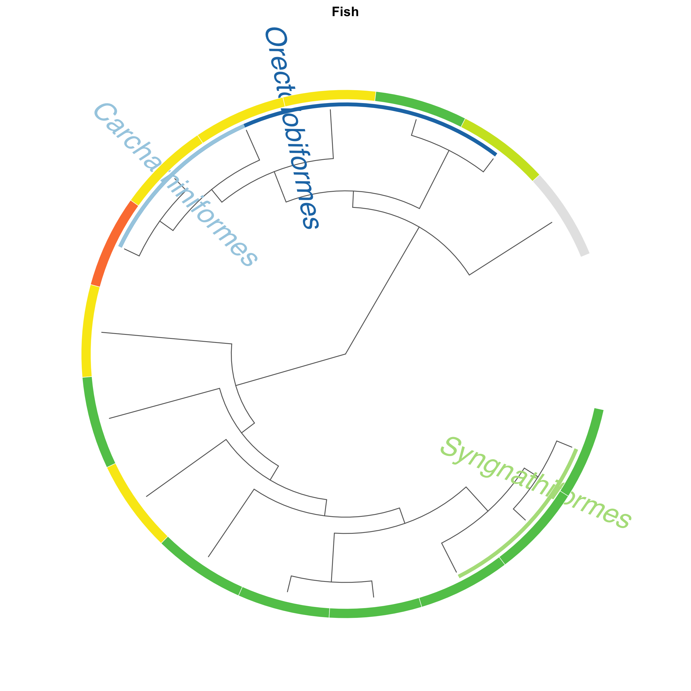

# Cryozoo_project

A [workflowr][] project documenting the species-selection and inventory
pipeline for **CryoZoo**, a biobank of live Tetrapod (mammal and bird) cell
lines profiled with a diverse set of genomics methods.

**Published site:** https://lewange.github.io/cryozoo-overview/

## What this repo does

Starting from a master list of candidate species and a set of Google Sheet
inventories (samples, cryotube stocks, cell culture, extractions,
sequencing), the pipeline cleans and joins the data, summarises the state of
the collection, and places selected species on time-calibrated mammal and
bird phylogenies.

See [analysis/README.md](analysis/README.md) for a full script-by-script
description of the pipeline, its inputs/outputs, and dependencies between
steps.

## Repository layout

- `analysis/` — workflowr R Markdown pipeline (see `analysis/README.md`)
- `code/` — shared R functions and standalone scripts
- `data/` — raw and reference data inputs
- `output/` — processed tables and figures produced by the pipeline
- `docs/` — rendered workflowr site (published via GitHub Pages)
- `archive/` — older exploratory scripts and outputs, not part of the active pipeline

## Simple phylogenetic trees

`analysis/plot_trees_simple.Rmd` builds one circular tree per taxonomic
group (Open Tree of Life topology, IUCN status ring), but the plots are only
written to file and not printed inline, so the knitted notebook page itself
shows no trees. Current output:

**Mammalia**


**Aves**


**Reptilia**


**Amphibia**


**Fish**



## Building the site

To rebuild after editing an analysis file:

```r
workflowr::wflow_build()
```

To publish:

```r
workflowr::wflow_publish("analysis/*.Rmd", "Message describing changes")
```

[workflowr]: https://github.com/workflowr/workflowr
